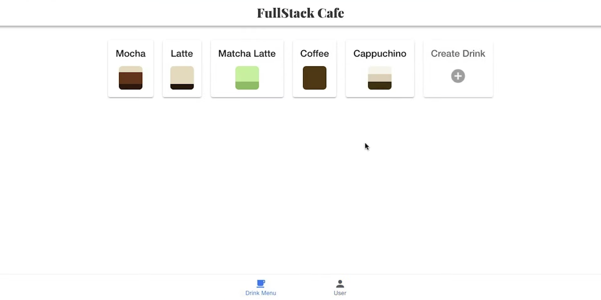

# Coffeeshop Full Stack - Ionic/Flask
[](https://www.python.org/)
[](https://ionicframework.com/)
[](https://opensource.org/licenses/MIT)

A backend RESTful API built-in Flask, with an Ionic frontend, that provides a variety of drinks to order from, with the ability to create new drinks, if permitted (Using Auth0/RBAC)

The backend code follows [PEP-8 style guidelines](https://www.python.org/dev/peps/pep-0008/).

### Getting Started
- Base URL: Currently this backend app can only be run locally. It's hosted by default at `127.0.0.1:5000` which is set as a proxy in the fronend configuration.

- Authentication: It require an Auth0 authentication and authorization for getting detailed drinks and drinks creation & deletion.

From the backend folder run `pip install -r requirements.txt`. All required packages are included in the requirements file.

To run the application, run the following commands inside the backend folder:

```
export FLASK_APP=src/api.py
export FLASK_ENV=development
flask run --reload
```

**Frontend**

Inside the fontend folder, run the following commands to start the client:

```
ionic serve
```

By default, the frontend will run on `localhost:8100`.

### Error Handling
Errors are returned as JSON obejcts in the following format:

```json
{
  "error": 404, 
  "message": "Not Found", 
  "success": false
}
```

Permitted User UI  |  Drink Creation Window
:-------------------------:|:-------------------------:
  |   

The Error types the API returns when requests fail are:
| HTTP Status Code | Response |
| ----------- | ----------- |
| 400 | Bad Request |
| 404 | Not Found |
| 405 | Method Not Allowed |
| 422 | Unprocessable Entity |
